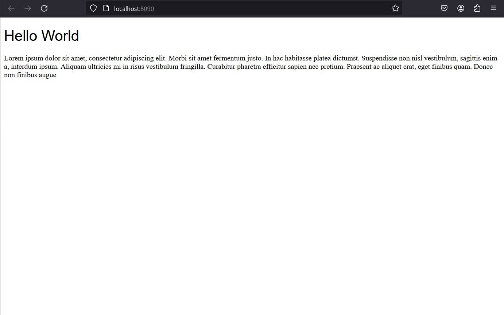

# A simplest nginx server with docker

## Dockerfile
```dockerfile
FROM nginx:alpine
COPY index.html /usr/share/nginx/html/index.html
```

## Build Image
```
$ docker build -t simple-nginx .
```

## Run Image

```
$ docker run --rm -it -p 8090:80 simple-nginx
```

## Access server
```html
$ curl localhost:8090
<!DOCTYPE html>
<html lang="en">
<head>
    <meta charset="UTF-8">
    <meta name="viewport" content="width=device-width, initial-scale=1.0">
    <meta http-equiv="X-UA-Compatible" content="ie=edge">
    <title>Hello World - Nginx Docker</title>
    <style>
        h1{
            font-weight:lighter;
            font-family: Arial, Helvetica, sans-serif;
        }
    </style>
</head>
<body>

    <h1>
        Hello World
    </h1>
    <p>Lorem ipsum dolor sit amet, consectetur adipiscing elit</p>

</body>
</html>
```

